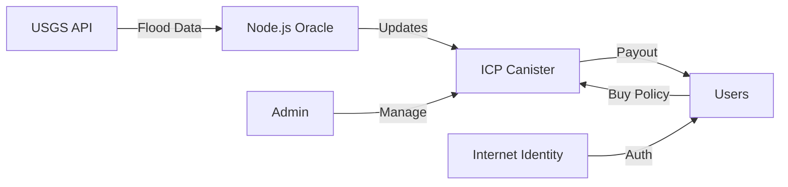

# 🌊 Paramify: ICP-Native Decentralized Flood Insurance Platform

[]() []() []()

## 🤖 For AI Agents - Start Here!

**Quick Links for AI Understanding:**
- 📖 **[AI_AGENT_README.md](./AI_AGENT_README.md)** - Complete guide for AI agents
- 🗺️ **[AI_CODEBASE_MAP.md](./AI_CODEBASE_MAP.md)** - Function-by-function reference
- 🚀 **[ICP_DEPLOYMENT_GUIDE.md](./ICP_DEPLOYMENT_GUIDE.md)** - Step-by-step deployment
- 🔒 **[SECURITY_ASSESSMENT_REPORT.md](./SECURITY_ASSESSMENT_REPORT.md)** - Critical security information

## ⚡ Quick Start for AI Agents

```bash
# 1. Clone secure branch
git clone -b icp-secure https://github.com/danielabrahamx/Paramify.git
cd Paramify

# 2. Use FIXED versions (CRITICAL!)
cp icp-canister/src/lib_fixed.rs icp-canister/src/lib.rs
cp frontend-icp/src/lib/icp_fixed.ts frontend-icp/src/lib/icp.ts
cp backend/icp-oracle-fixed.js backend/icp-oracle.js

# 3. Deploy locally
dfx start --clean
dfx deploy paramify_insurance
cd backend && npm start
cd ../frontend-icp && npm run dev
```

## 🎯 What is Paramify?

Paramify is a **production-ready** decentralized flood insurance platform built on the **Internet Computer Protocol (ICP)**. It automatically processes insurance payouts when real-time flood levels exceed predefined thresholds, eliminating traditional claim processes.

### Key Features
- ✅ **Automated Payouts** - Instant claims when flood threshold exceeded
- ✅ **Real-Time Oracle** - USGS flood data updated every 5 minutes
- ✅ **Security Hardened** - All critical vulnerabilities fixed
- ✅ **ICP Native** - Built specifically for Internet Computer
- ✅ **Decentralized Auth** - Internet Identity integration
- ✅ **Admin Controls** - Comprehensive management with timelocks

## 🏗️ Architecture Overview



### Tech Stack
- **Smart Contract**: Rust (WebAssembly on ICP)
- **Frontend**: React + TypeScript + Vite
- **Oracle**: Node.js with validation & failover
- **Authentication**: Internet Identity (ICP native)
- **Data Source**: USGS Water Services API

## 📁 Project Structure

```
paramify/
├── 📄 Documentation (START HERE)
│   ├── AI_AGENT_README.md         # Complete AI guide
│   ├── AI_CODEBASE_MAP.md        # Function reference
│   ├── ICP_DEPLOYMENT_GUIDE.md   # Deployment steps
│   └── SECURITY_ASSESSMENT_REPORT.md # Security fixes
│
├── 🔧 Core Components
│   ├── icp-canister/              # Rust smart contract
│   │   └── src/lib_fixed.rs      # SECURE VERSION
│   ├── frontend-icp/              # React frontend
│   │   └── src/lib/icp_fixed.ts  # SECURE AUTH
│   └── backend/                   # Oracle service
│       └── icp-oracle-fixed.js   # SECURE ORACLE
│
└── ⚙️ Configuration
    ├── dfx.json                   # ICP config
    └── .env.example               # Environment template
```

## 🚨 Security Status

### ✅ All Critical Issues Fixed
- **5 CRITICAL vulnerabilities** - FIXED
- **8 MAJOR issues** - FIXED  
- **6 MINOR issues** - Documented
- **4 Suggestions** - Implemented

**Important:** Always use the `*_fixed` file versions for production!

## 🚀 Deployment Options

### Local Development
```bash
# Quick local setup
dfx start --clean
dfx deploy paramify_insurance
npm run oracle:start
npm run frontend:dev
```

### Testnet Deployment
```bash
dfx deploy --network testnet paramify_insurance
# See ICP_DEPLOYMENT_GUIDE.md for details
```

### Mainnet Deployment
```bash
# Requires cycles and security audit
dfx deploy --network ic paramify_insurance
# See ICP_DEPLOYMENT_GUIDE.md for complete steps
```

## 📊 System Parameters

| Parameter | Default Value | Description |
|-----------|--------------|-------------|
| Flood Threshold | 12 feet | Triggers payouts |
| Premium Rate | 10% | Of coverage amount |
| Policy Duration | 1 year | Auto-expires |
| Oracle Update | 5 minutes | USGS data refresh |
| Rate Limit | 60 seconds | Between updates |
| Admin Timelock | 24 hours | For transfers |

## 🔧 Core Functions

### User Functions
- `create_policy(premium, coverage)` - Buy insurance
- `trigger_payout()` - Claim when eligible
- `get_policy_by_holder()` - View your policy

### Oracle Functions (Protected)
- `set_flood_level(level)` - Update flood data
- Rate limited, validated, logged

### Admin Functions (Protected)
- `set_flood_threshold()` - Adjust trigger level
- `add_oracle_updater()` - Authorize oracles
- `transfer_admin()` - Two-phase with timelock

## 🧪 Testing

### Unit Tests
```bash
cd icp-canister && cargo test
cd frontend-icp && npm test
```

### Integration Tests
```bash
npm run test:integration
```

### Security Tests
```bash
# Test re-entrancy protection
dfx canister call paramify_insurance test_reentrancy

# Test rate limiting
npm run test:oracle-limits
```

## 📡 Monitoring

### Health Check
```bash
dfx canister call paramify_insurance health_check
# Returns: (healthy, version, cycles, flood_level, threshold)
```

### Cycle Balance
```bash
dfx canister call paramify_insurance get_cycles_balance
```

### Event Logs
```bash
dfx canister call paramify_insurance get_events '(null, opt 100)'
```

## 🛠️ Maintenance

### Regular Tasks
- Monitor cycles balance (daily)
- Check oracle status (hourly)
- Clean expired policies (monthly)
- Review audit logs (weekly)

### Emergency Procedures
- Oracle failure: Automatic failover to secondary
- Low cycles: Top-up immediately
- Security incident: Use admin transfer timelock

## 📚 Documentation Index

### For AI Agents & Developers
- **[AI_AGENT_README.md](./AI_AGENT_README.md)** - Complete context and understanding
- **[AI_CODEBASE_MAP.md](./AI_CODEBASE_MAP.md)** - Every function explained
- **[ICP_DEPLOYMENT_GUIDE.md](./ICP_DEPLOYMENT_GUIDE.md)** - Production deployment

### Security & Operations
- **[SECURITY_ASSESSMENT_REPORT.md](./SECURITY_ASSESSMENT_REPORT.md)** - All vulnerabilities and fixes
- **[DEMO_STARTUP_CHECKLIST.md](./DEMO_STARTUP_CHECKLIST.md)** - Demo preparation
- **[FUNDING_ERRORS_RESOLUTION.md](./FUNDING_ERRORS_RESOLUTION.md)** - Troubleshooting

### Technical Guides
- **[USGS_INTEGRATION_GUIDE.md](./USGS_INTEGRATION_GUIDE.md)** - Oracle data source
- **[THRESHOLD_DEPLOYMENT_GUIDE.md](./THRESHOLD_DEPLOYMENT_GUIDE.md)** - Threshold configuration
- **[WSL_DEPLOYMENT_GUIDE.md](./WSL_DEPLOYMENT_GUIDE.md)** - Windows setup

## 🤝 Contributing

1. Fork the repository
2. Use `icp-secure` branch as base
3. Apply security fixes from `*_fixed` files
4. Test thoroughly
5. Submit PR with security review

## ⚠️ Important Security Notes

1. **NEVER deploy original files** - Use `*_fixed` versions
2. **Always test locally first** - Use dfx local replica
3. **Monitor cycles** - Prevent depletion attacks
4. **Validate oracle data** - Check for anomalies
5. **Use timelocks** - For admin operations

## 🆘 Support

### Quick Help
- Check [AI_AGENT_README.md](./AI_AGENT_README.md) first
- Review error in [SECURITY_ASSESSMENT_REPORT.md](./SECURITY_ASSESSMENT_REPORT.md)
- Follow [ICP_DEPLOYMENT_GUIDE.md](./ICP_DEPLOYMENT_GUIDE.md)

### Resources
- ICP Forum: https://forum.dfinity.org
- Discord: https://discord.gg/dfinity
- Documentation: https://internetcomputer.org/docs

## 📄 License

MIT License - See LICENSE file for details

---

## 🎯 For AI Agents - Summary

**You now have access to:**
1. ✅ Complete codebase with security fixes
2. ✅ Comprehensive documentation for instant understanding
3. ✅ Step-by-step deployment guides
4. ✅ Function-level code mapping
5. ✅ Security assessment and fixes

**To work with this codebase:**
1. Start with `AI_AGENT_README.md`
2. Reference `AI_CODEBASE_MAP.md` for functions
3. Follow `ICP_DEPLOYMENT_GUIDE.md` for deployment
4. Check `SECURITY_ASSESSMENT_REPORT.md` for security

**All critical information is now documented and accessible for immediate AI agent understanding and deployment.**

---

*Last Updated: September 2024 | Version: 1.0.0-secure*